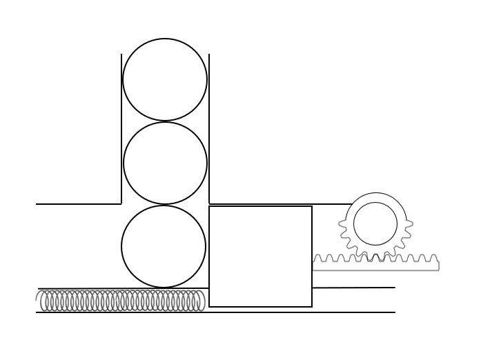
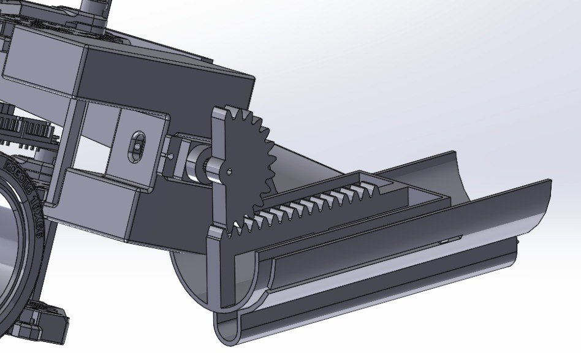
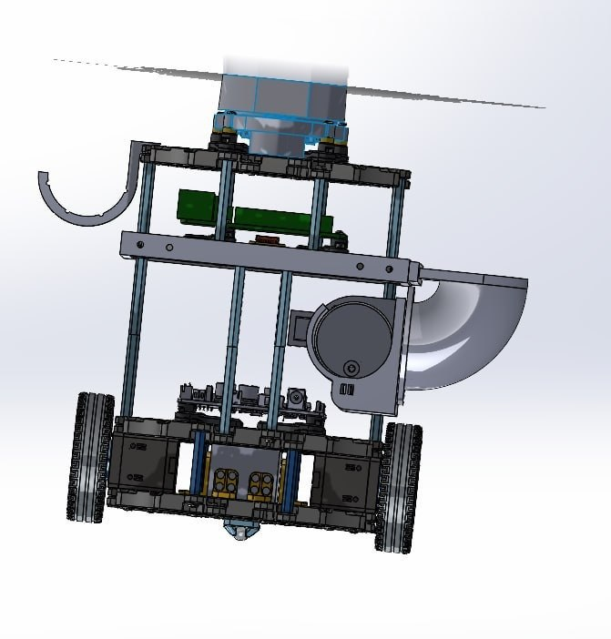
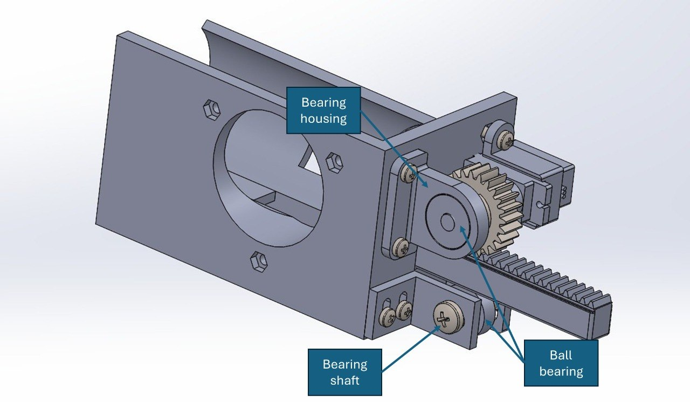
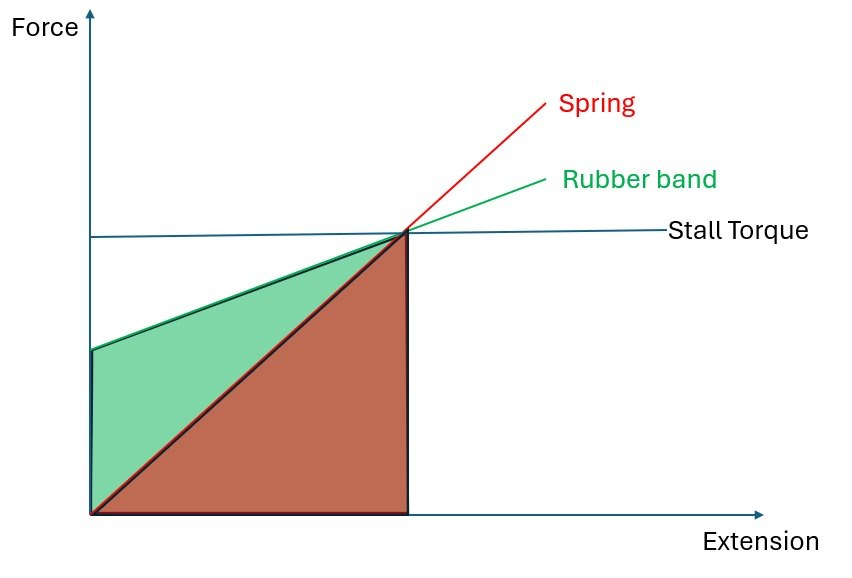

# Hardware <!-- omit in toc -->

CAD files and mechanical documentation for the AMR.

- `launcher/` — SolidWorks CAD for the spring-loaded launcher assembly
- `chassis/` — TurtleBot3 mounting plates and chassis modifications

# Table of contents <!-- omit in toc -->
- [Overview](#overview)
- [System Description](#system-description)
- [Design Objectives](#design-objectives)
- [CAD File Structure](#cad-file-structure)
- [Initial concept development](#initial-concept-development)
  - [Concept 1: rack and half pinion](#concept-1-rack-and-half-pinion)
- [Changelog](#changelog)
  - [Version 1.0.0 - first design](#version-100---first-design)
  - [Version 2.0.0 - servo integrated into launcher](#version-200---servo-integrated-into-launcher)
  - [Version 2.1.0 - bearing supports for rack and pinion](#version-210---bearing-supports-for-rack-and-pinion)
  - [Version 2.2.0 - clutch bearing reset](#version-220---clutch-bearing-reset)
  - [Final Performance summary](#final-performance-summary)
- [Key mechanism explanations](#key-mechanism-explanations)
  - [Rubber band vs Spring](#rubber-band-vs-spring)
  - [Clutch bearing reset](#clutch-bearing-reset)
  - [Rack and pinion engagement](#rack-and-pinion-engagement)

# Payload and Mounting System for Maze Navigation Robot <!-- omit in toc -->

## Overview

This repository contains the CAD models for the payload
and mounting systems used in the AMR.

The system supports:
- Raspberry Pi Camera module 2
- Launcher subsystem
- Ball feeder
- Structural mounting to chassis

The design focuses on simplicity, repeatability and keeping the robot as slim as possible.

---

## System Description

The payload system consists of:

1. Mounting plate 
2. Camera Mount  
3. Launcher
4. Launcher mount 
5. Ball feeder

---

## Design Objectives

- Maintain robot size as much as possible
- Ensure unobstructed LiDAR view
- Position camera at optimal location for docking
- Minimize overall center of gravity
- Ensure repeatability of launcher

---

## CAD File Structure

<!-- TODO -->

## Initial concept development

### Concept 1: rack and half pinion

How it works:
- The pinion was to be powered by a continuous servo motor
- At the start, the teeth on the pinion catches on to the rack pulling the plunger back, allowing the ball to fall in position
- At the end of the pinion, the rack is released, launching the ball
- The plunger now in a foward position prevents the next ball from being loaded immediately

Pros: <!--TODO -->

## Changelog
### Version 1.0.0 - first design

Problems Observed:

- The servo was mounted directly to the chassis instead of the launcher assembly.
This caused structural flexing during operation, leading to misalignment between the pinion and rack and resulting in slipping.
- Mounting the servo on the chassis also prevented independent testing of the launcher mechanism.
This slowed down development because launcher testing depended on Turtlebot availability.
- Nav team feedback that current poition of launcher would make moving through the maze challenging.

### Version 2.0.0 - servo integrated into launcher

Changes from Previous Version:

- Mounted the servo directly onto the launcher assembly to reduce structural flex.
- Repositioned the launcher between waffle plates instead of side-mounted to improve structural support.

Problems Observed:

- Launcher achieved poor range, indicating insufficient stored energy and inefficiencies.
- The plunger occasionally became stuck and failed to release.
- Pinion slipping issue persisted due to insufficient constraint of both rack and pinion.
- When assembling putting plunger into tube was challenging.

Possible Root Causes:

- Rack alignment was not properly constrained.
- Pinion support was only provided on one side, allowing tilting under load.
- The plunger face and rack being one piece makes it hard and awkward to fit into the tube.

### Version 2.1.0 - bearing supports for rack and pinion

Changes from Previous Version:
- Added a ball bearing and housing to support the pinion from the opposite side, improving alignment and reducing tilting.
- Added a shaft and bearing system beneath the rack to prevent downward movement during loading.
- Replaced the spring with a rubber band to increase stored elastic energy while keeping motor torque below stall limits.
- Split plunger into plunger face and rack to be fastened together with M3 screw.

Problems Observed:
- Pinion position after each launch is inconsistent.

Possible root causes:
- Continuous servo does not have rotation control
- Tuning each rotation by time is difficult and impractical
- Rotation error after each launch stacks up 

### Version 2.2.0 - clutch bearing reset

Changes from Previous Version:

- Added a clutch bearing and inner ring to allow the pinion to reset to a consistent starting position after each launch.
- Modified the pinion design to house the clutch bearing internally.

Problems Observed:

- Engagement between the pinion and rack occurred at inconsistent positions.
- In some cases, the plunger was already fully retracted before rack was released

Fix Implemented:

- Added washers between the plunger face and rack to shift the rack starting position.

Result After Fix:

- Engagement between pinion and rack became consistent.

### Final Performance summary
- No slippage between rack and pinion during repeated testing
- Consistent engagement between rack and pinion
- Pinion achieves consistent reset position
- Plunger motion is smooth and repeatable

## Key mechanism explanations

### Rubber band vs Spring

Rubber band can be already be streched when the plunger is in the fowardmost position allowing us to store more energy while keeping within the stall torque.

### Clutch bearing reset

Problem: Loss of Positional Control in Continuous Servo Motors

The TowerPro MG90 Servo Motor was modified to allow continuous rotation.
As a result, positional control was lost, and the PWM signal controlled motor speed instead of angular position.

This created several issues:

- The angular position of the pinion before each launch became unpredictable.
- The time taken for one full rotation varied due to changing conditions such as rubber band tension, friction, and mechanical load.
- Small timing errors accumulated after each cycle.
- This caused inconsistent pinion starting positions, leading to unreliable launches.
- In some cases, this resulted in failed launches or multiple balls being released unintentionally.

Solution: Use of a Clutch Bearing for Passive Reset

A clutch bearing was introduced to allow the pinion to reset to a consistent angular position after every launch cycle.

A clutch bearing allows rotation in one direction while locking in the opposite direction.

This directional locking property was used to create a passive mechanical reset mechanism, removing reliance on timing accuracy.

Working Principle:
1. Rack Loading Phase (Clockwise Rotation)

During loading:
- The servo rotates clockwise.
- The clutch bearing locks in this direction.
- Torque is transferred from the servo to the pinion.
- The pinion engages the rack and pulls it backward.
- Elastic energy is stored in the rubber band.
- The rack is released at the end of the pinion as per normal.

2. Reset Phase (Anticlockwise Rotation)

After launch:

- The servo rotates anticlockwise.
- The clutch bearing allows free rotation in this direction.
- The pinion rotates together with the servo initially.

- Once the pinion reaches its reset position, the clutch slips internally.
- This allows the pinion to remain stationary while the servo continues to rotate freely.

This ensures that:

- The pinion always returns to the same angular position.
### Rack and pinion engagement
